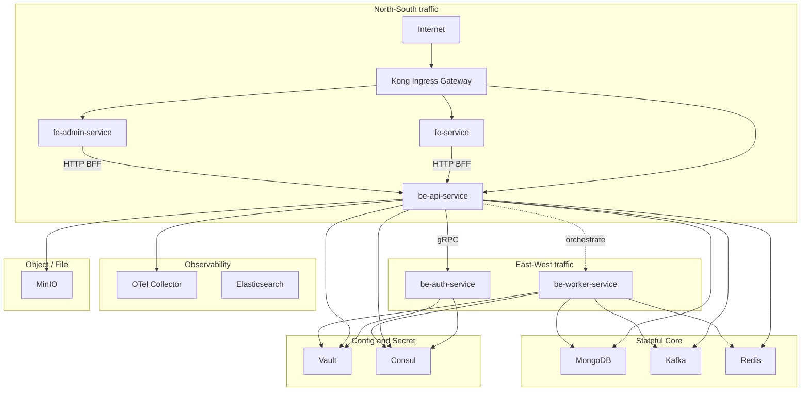
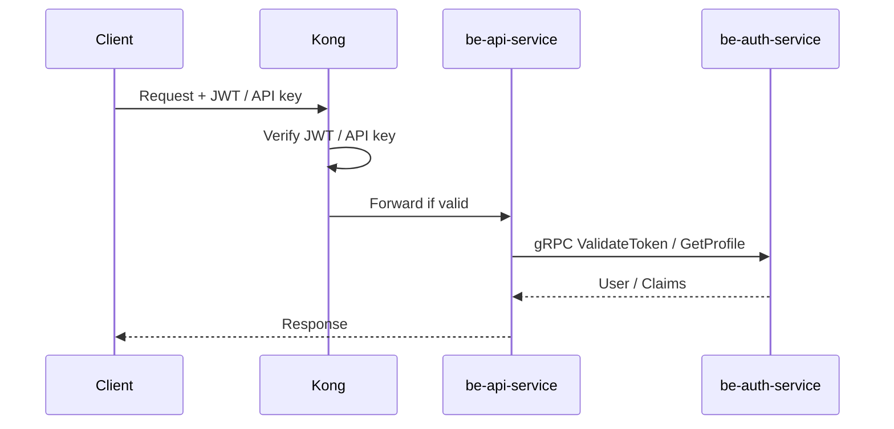

# TechInsight – Kiến trúc version 2 (North–South, East–West, phân tầng infra)

Tài liệu mô tả luồng traffic, phân tầng hạ tầng và auth flow theo hướng production trên Kubernetes.

---

## 1. North–South và East–West

**North–South**: Traffic từ Internet vào cluster (và ngược lại). Toàn bộ đi qua **một điểm vào** là Kong Ingress Gateway. Kong route theo host/path tới fe-service, fe-admin-service hoặc be-api-service. FE chỉ gọi be-api-service (BFF); không gọi trực tiếp auth, worker hay infra.

**East–West**: Traffic giữa các service trong cluster. be-api-service gọi be-auth-service (gRPC) để validate token / lấy profile; có thể orchestrate be-worker-service (queue/job). Các service kết nối tới infra (DB, queue, object store, observability) theo từng tầng dưới đây.

---

## 2. Sơ đồ North–South + East–West và phân tầng infra

---

## 3. Phân tầng infra

| Tầng | Thành phần | Vai trò | Lưu ý vận hành |
|------|------------|--------|-----------------|
| **Stateful Core** | MongoDB, Kafka, Redis | Data, queue, cache; nền tảng state | Cần backup, scale cẩn thận; có thể tách namespace hoặc cluster riêng. |
| **Observability** | OTel Collector, Elasticsearch | Logs, traces, metrics | Có thể dùng managed service hoặc tách cluster; ít ảnh hưởng business logic. |
| **Object / File** | MinIO | Object storage (file, ảnh) | Có thể thay bằng S3/compatible khác; backup bucket theo nhu cầu. |
| **Config / Secret** | Vault, Consul | Bootstrap + runtime secret và config | Vault cho secret; Consul cho config/KV; pods auth bằng K8s Service Account. |

---

## 4. Auth flow (Kong + be-auth-service)

- **Kong (Ingress)**: Xử lý JWT verification, API key (nếu dùng). Chỉ forward request hợp lệ tới be-api-service (và FE nếu cần). Giảm tải cho be-api-service, tập trung auth tại một lớp.
- **be-auth-service**: Login, issue token, user profile (gRPC). be-api-service gọi khi cần validate/refresh token hoặc lấy profile.

---

## 5. Chuẩn K8s và hướng scale

- **Single Ingress**: Kong là một điểm vào North–South; không dùng thêm Traefik hay gateway khác.
- **BFF**: FE chỉ gọi be-api-service; không gọi trực tiếp auth, worker hay infra.
- **Infra tách rõ**: Stateful Core, Observability, Object, Config/Secret phân tầng; dễ backup, scale và có thể external hóa từng phần.
- **God service**: be-api-service hiện đóng vai trò orchestrator (gọi auth, worker, nhiều infra). Chấp nhận được ở quy mô nhỏ; khi mở rộng nên định hướng tách dần theo domain (ví dụ tách service theo nghiệp vụ) để giảm coupling và dễ scale từng phần.
