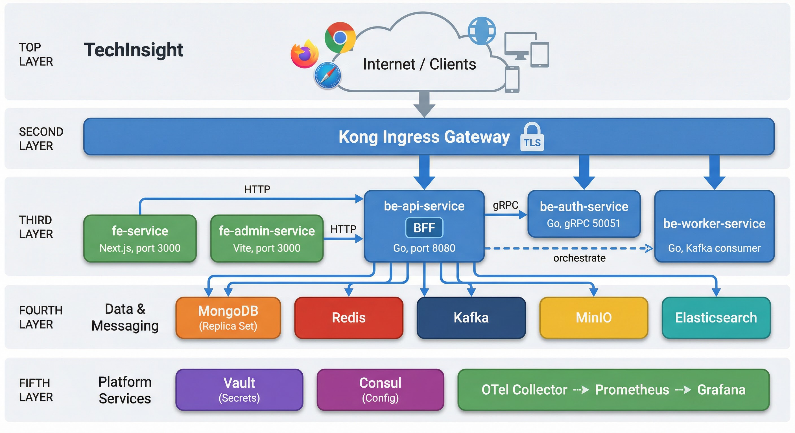
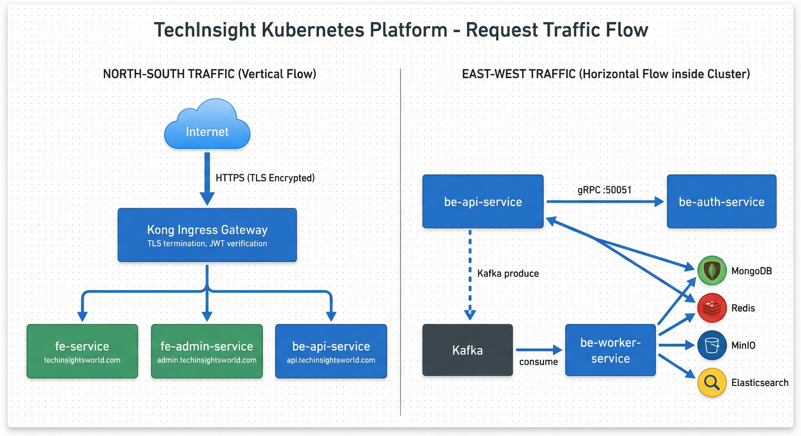
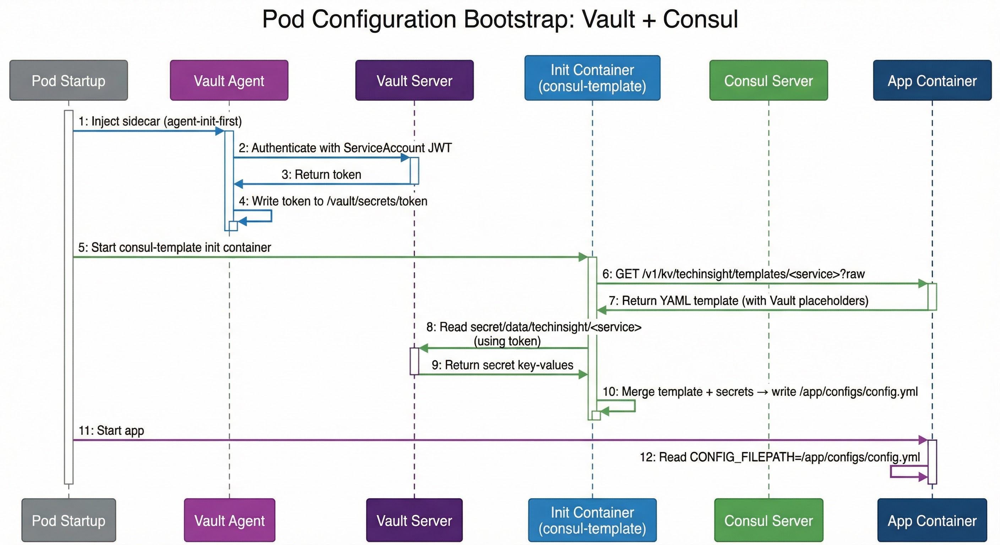
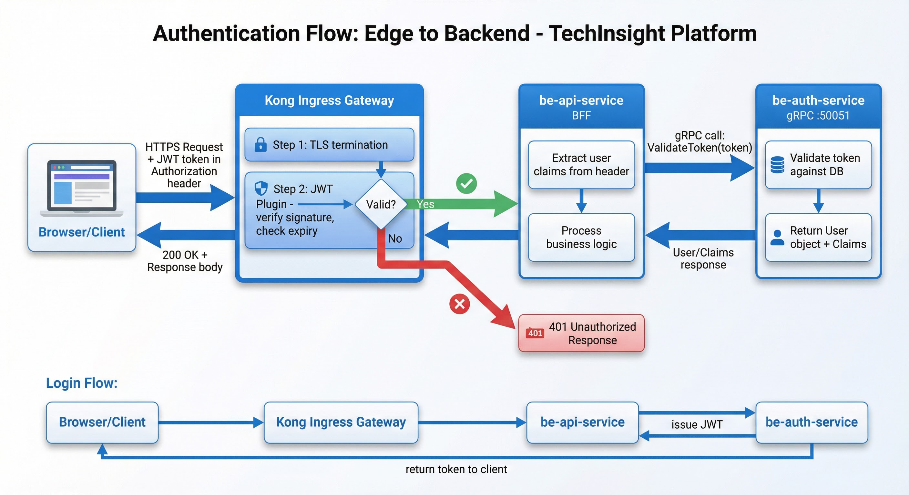
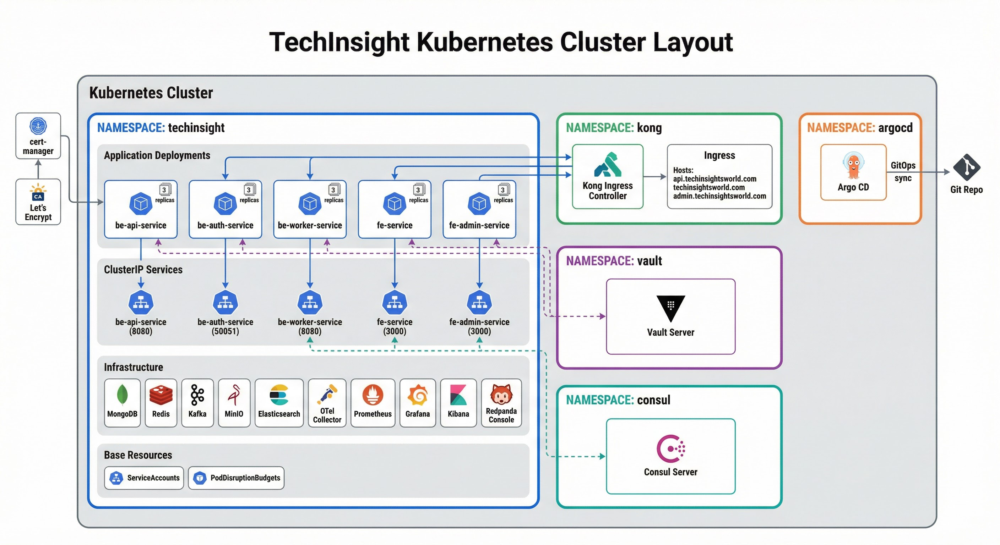
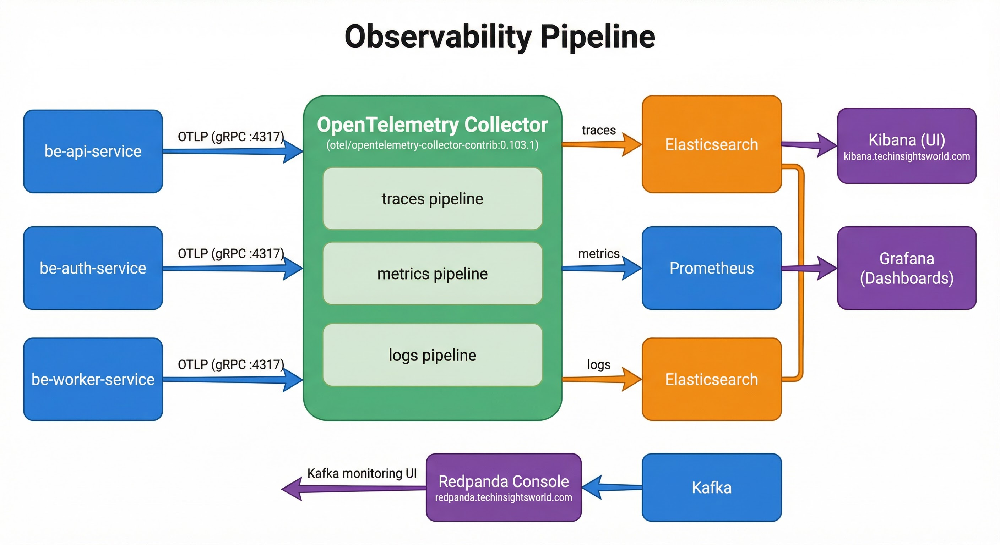
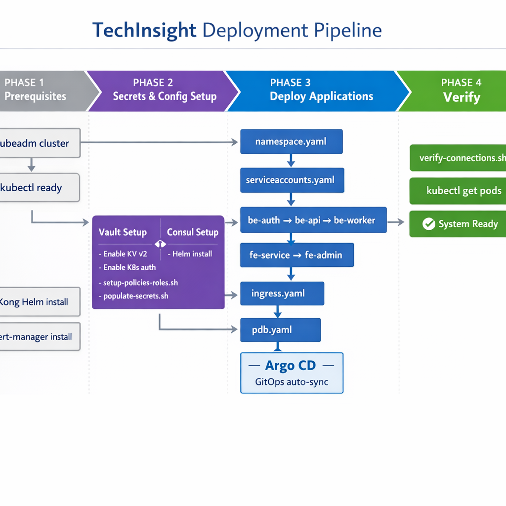

# Building TechInsight: Designing and Deploying a Production-Grade Platform on Kubernetes

> A deep dive into the architecture, technology choices, infrastructure design, and operational patterns behind TechInsight — from the first request hitting the edge to the last log line reaching Elasticsearch.

---

## Table of Contents

- [1. The Big Picture](#1-the-big-picture)
- [2. How Traffic Flows Through the System](#2-how-traffic-flows-through-the-system)
- [3. Why We Chose This Stack](#3-why-we-chose-this-stack)
- [4. The Backend: Three Services, One Codebase Philosophy](#4-the-backend-three-services-one-codebase-philosophy)
- [5. The Frontend: Two Apps, Two Frameworks](#5-the-frontend-two-apps-two-frameworks)
- [6. The Data Layer: Right Tool for Each Job](#6-the-data-layer-right-tool-for-each-job)
- [7. Secrets and Configuration: The Vault + Consul Strategy](#7-secrets-and-configuration-the-vault--consul-strategy)
- [8. Authentication: From Edge to Backend](#8-authentication-from-edge-to-backend)
- [9. Kubernetes: How Everything Runs](#9-kubernetes-how-everything-runs)
- [10. Observability: Seeing Everything](#10-observability-seeing-everything)
- [11. Deploying to Production](#11-deploying-to-production)
- [12. Security Posture](#12-security-posture)
- [13. Scaling and What Comes Next](#13-scaling-and-what-comes-next)
- [14. Conclusion](#14-conclusion)

---

## 1. The Big Picture

TechInsight is a content and knowledge platform. Users browse articles, interact with content, and manage their profiles through a modern web interface. Administrators manage content, users, and platform settings through a separate admin panel. Behind the scenes, a Go-based API handles business logic, an auth service manages identity over gRPC, and a worker service processes asynchronous jobs from a Kafka queue.

Everything runs on Kubernetes. A single Kong Ingress Gateway sits at the edge, terminating TLS and routing requests to the right service. Configuration comes from Consul; secrets come from Vault. Observability flows through OpenTelemetry into Elasticsearch and Prometheus. GitOps is handled by Argo CD.

This is not a toy project. It is a production system designed with real-world constraints: high availability, zero-secret-in-repo, structured observability, and clear separation of concerns.

Here is the full system architecture:



The architecture follows a layered design:

- **Layer 1 — Edge:** Kong Ingress Gateway handles all inbound traffic, TLS termination, JWT verification, and host-based routing.
- **Layer 2 — Applications:** Five services (two frontends, three backends) handle the product logic.
- **Layer 3 — Data and Messaging:** MongoDB, Redis, Kafka, MinIO, and Elasticsearch each serve a distinct purpose.
- **Layer 4 — Platform Services:** Vault, Consul, OpenTelemetry, Prometheus, and Grafana provide the operational backbone.

Every layer is independently replaceable. MongoDB could become a managed Atlas cluster. MinIO could become AWS S3. The OTel Collector could export to Datadog instead of Elasticsearch. The architecture is designed to allow this without changing application code.

---

## 2. How Traffic Flows Through the System

Understanding a system means understanding how data moves through it. TechInsight has two distinct traffic patterns: **North-South** (external) and **East-West** (internal).



### North-South: Internet to Cluster

Every external request enters through **Kong Ingress Gateway**. Kong is the single entry point — there is no other load balancer, reverse proxy, or gateway in front. It terminates TLS (certificates managed by cert-manager with Let's Encrypt), verifies JWT tokens for protected routes, and routes by hostname:

| Hostname | Destination |
|----------|-------------|
| `techinsightsworld.com` | fe-service (public website) |
| `www.techinsightsworld.com` | fe-service (public website) |
| `admin.techinsightsworld.com` | fe-admin-service (admin panel) |
| `api.techinsightsworld.com` | be-api-service (backend API) |
| `minio.techinsightsworld.com` | MinIO (object storage) |
| `kibana.techinsightsworld.com` | Kibana (log/trace UI) |
| `redpanda.techinsightsworld.com` | Redpanda Console (Kafka UI) |

Both frontends follow the **Backend-for-Frontend (BFF)** pattern: they only ever call `be-api-service`. They never talk to auth, worker, or any infrastructure component directly. This keeps the API surface clean and centralizes all backend orchestration in one place.

### East-West: Service to Service

Inside the cluster, traffic flows horizontally between services:

- **be-api-service → be-auth-service:** Over gRPC on port 50051. The API calls auth to validate tokens (`ValidateToken`) and fetch user profiles (`GetProfile`). This is a ClusterIP service — no ingress, no external exposure.
- **be-api-service → Kafka → be-worker-service:** The API produces messages to Kafka topics. The worker consumes from those same topics and processes them asynchronously. This decouples heavy operations (image processing, email sending, analytics) from the request-response cycle.
- **All backends → Data stores:** be-api-service and be-worker-service both connect to MongoDB, Redis, Kafka, MinIO, and Elasticsearch. be-auth-service connects to MongoDB and Redis (for user data and session/token caching).

---

## 3. Why We Chose This Stack

Every technology choice in TechInsight solves a specific problem. Here is the reasoning behind each decision.

### Go for the Backend

Go compiles to a single binary, starts in milliseconds, and uses minimal memory. For a Kubernetes environment where pods start and stop frequently, this matters. Go's goroutine model handles thousands of concurrent connections without the overhead of thread pools. The standard library covers HTTP, JSON, crypto, and more — reducing dependency sprawl.

We run three binaries from two images:
- `./main` for the API (HTTP + WebSocket + gRPC client)
- `./main` for the auth service (gRPC server)
- `./worker` for the Kafka consumer (same codebase as the API, different entry point)

### gRPC for Internal Communication

The API-to-auth communication uses gRPC instead of REST. gRPC uses Protocol Buffers (binary serialization), which is faster and smaller than JSON. It provides strict contracts via `.proto` files, built-in code generation, and native streaming support. For internal service-to-service calls where latency matters and the contract is well-defined, gRPC is the right choice.

### Next.js for the Public Website

The public-facing website uses Next.js. Server-side rendering (SSR) is critical for SEO — search engines need to see rendered HTML, not a blank page that loads JavaScript. Next.js also provides image optimization, automatic code splitting, and API routes for server-side data fetching (e.g., calling be-api-service from the server before sending HTML to the browser).

### Vite for the Admin Panel

The admin panel does not need SEO. It is a private, authenticated interface. Vite provides a fast development experience with hot module replacement (HMR) and produces optimized bundles. It is lighter than Next.js for this use case because we do not need SSR, static generation, or middleware.

### Kong as the API Gateway

Kong is a battle-tested API gateway built on NGINX. It provides JWT verification, rate limiting, CORS, and request/response transformation as plugins — without writing code. As a Kubernetes Ingress Controller, it integrates natively with Kubernetes Ingress resources, cert-manager, and service discovery.

We chose Kong over alternatives like Traefik or NGINX Ingress because:
- Plugin ecosystem (JWT, rate limiting, logging) without custom code
- Declarative configuration via Kubernetes annotations
- Production-proven at scale

### MongoDB for the Primary Database

TechInsight stores articles, user profiles, comments, and metadata. The data model is document-oriented — articles have nested structures (sections, tags, media references) that map naturally to MongoDB documents. The replica set (`rs0`) provides read scaling and failover.

### Redis for Caching and Sessions

Redis serves two roles: caching frequently accessed data (article lists, user profiles) and storing session state. With connection pooling (`pool_size: 10`, configurable timeouts), it handles high-throughput reads with sub-millisecond latency.

### Kafka for Asynchronous Processing

When a user uploads an image, the API does not process it synchronously. It publishes a message to Kafka and returns immediately. The worker picks it up and handles the heavy lifting (resizing, uploading to MinIO, updating the article). This pattern keeps API response times low and lets the worker scale independently.

Kafka (with Zookeeper) provides durable, ordered message delivery with consumer groups. The worker uses Snappy compression and configurable batch sizes for throughput optimization.

### MinIO for Object Storage

Images, files, and media assets are stored in MinIO, an S3-compatible object storage system. It runs in the cluster and exposes a public URL via Kong (`minio.techinsightsworld.com`). If we ever need to migrate to AWS S3 or another provider, the S3 API compatibility means zero code changes.

### Elasticsearch for Search and Logs

Elasticsearch serves double duty. The application uses it for full-text search (articles, users), and the observability pipeline uses it for log and trace storage. The OTel Collector exports to separate indices (`techinsight-logs`, `techinsight-traces`), so application search and operational logs do not interfere with each other.

---

## 4. The Backend: Three Services, One Codebase Philosophy

### be-api-service: The Orchestrator

The API service is the heart of the platform. It handles:

- **REST API:** CRUD for articles, users, comments, media
- **WebSocket:** Real-time notifications and updates (path `/ws`)
- **BFF orchestration:** Aggregates data from MongoDB, Redis, Elasticsearch, and MinIO into responses tailored for each frontend
- **Auth delegation:** Calls be-auth-service over gRPC for token validation and user profile retrieval
- **Event production:** Publishes to Kafka for async processing

It runs as `./main` on port 8080 with health checks at `GET /metrics/health`. Configuration is loaded from a single file: `/app/configs/config.yml`.

Key configuration sections include:

```yaml
app:
  name: "TechInsight API"
  port: 8080
  shutdown_timeout: 30s
server:
  cors:
    allowed_origins: ["https://techinsightsworld.com", "https://admin.techinsightsworld.com"]
  rate_limit:
    enabled: true
    requests_per_minute: 100
    burst: 50
kafka:
  brokers: ["broker:9092"]
  consumer_group_id: "techinsight-api-group"
  producer:
    compression: "snappy"
websocket:
  enabled: true
  path: "/ws"
auth:
  grpc:
    addr: "be-auth-service:50052"
```

### be-auth-service: Identity Over gRPC

The auth service exposes HTTP on port `50051` (public REST via `/v1/auth-services` path on `api.techinsightsworld.com`) and gRPC on port `50052` (internal service-to-service communication). It owns user identity: login, token issuance (JWT), token validation, and profile retrieval. By isolating auth into its own service:

- Security surface is smaller (gRPC internal, HTTP proxied via Kong)
- It can be scaled independently during login spikes
- Token logic changes do not require redeploying the API

The health check uses a TCP socket probe on 50051 (gRPC does not natively support HTTP health endpoints without additional setup).

### be-worker-service: The Async Engine

The worker shares the same Docker image as the API (`lifegoeson34/techinsight-api:latest`) but runs a different binary: `./worker`. This means the API and worker share models, database clients, and utility code but have completely separate entry points and lifecycles.

The worker:
- Consumes from Kafka topics (e.g., image processing, email sending, analytics events)
- Writes to MongoDB, Redis, and MinIO
- Has no HTTP server (health is checked by verifying the config file exists: `test -f /app/configs/config.yml`)

This shared-codebase, separate-binary approach avoids code duplication while keeping deployments independent.

---

## 5. The Frontend: Two Apps, Two Frameworks

### fe-service: The Public Face (Next.js)

The public website at `techinsightsworld.com` is a Next.js application. It runs on port 3000 and is configured via environment variables:

```
API_URL=http://be-api-service:8080/api          # Server-side (inside cluster)
NEXT_PUBLIC_API_URL=https://api.techinsightsworld.com/api  # Client-side (browser)
MINIO_ENDPOINT=minio:9000                        # Server-side MinIO
NEXT_PUBLIC_MINIO_PUBLIC_URL=https://minio.techinsightsworld.com  # Client-side MinIO
```

The dual URL pattern (`API_URL` vs `NEXT_PUBLIC_API_URL`) is a Next.js convention. Server-side rendering calls the API via the internal ClusterIP address (fast, no TLS overhead). Client-side JavaScript calls via the public domain (through Kong, with TLS).

### fe-admin-service: The Control Room (Vite)

The admin panel at `admin.techinsightsworld.com` is built with Vite. It uses a similar pattern:

```
API_URL=http://be-api-service:8080/api
VITE_API_URL=https://api.techinsightsworld.com/api
VITE_MINIO_DOMAIN=https://minio.techinsightsworld.com
```

Since Vite builds are purely client-side (no SSR), the `VITE_*` variables are embedded at build time.

Neither frontend uses Vault or Consul. They receive configuration only through environment variables set in their Kubernetes Deployment manifests.

---

## 6. The Data Layer: Right Tool for Each Job

Each data technology in TechInsight serves a distinct, non-overlapping purpose. There is no ambiguity about which system stores what.

| System | What it stores | Why this system |
|--------|---------------|-----------------|
| **MongoDB** | Articles, users, comments, profiles, metadata | Document model fits nested content; replica set for HA and read scaling |
| **Redis** | Session tokens, cached API responses, rate limit counters | Sub-millisecond reads; in-memory; TTL-based expiry |
| **Kafka** | Async events (image processing, email, analytics) | Durable ordered queue; consumer groups; decouples producers from consumers |
| **MinIO** | Images, files, media assets | S3-compatible; runs in-cluster; public URL for CDN-like access |
| **Elasticsearch** | Full-text search index, logs, traces | Inverted index for search; structured storage for observability data |

### MongoDB Configuration

MongoDB runs as a replica set (`rs0`) with a single primary node (expandable). The connection uses majority read/write concern for consistency:

```yaml
database:
  mongodb:
    uri: "mongodb://mongo1:27017/techinsight?replicaSet=rs0"
    database: "techinsight"
    max_pool_size: 100
    read_concern: "majority"
    write_concern: "majority"
    retry_writes: true
```

### Redis Configuration

Redis is configured with connection pooling and aggressive timeouts to prevent connection leaks:

```yaml
cache:
  redis:
    addr: "redis:6379"
    pool_size: 10
    dial_timeout: 5s
    read_timeout: 3s
    write_timeout: 3s
    max_retries: 3
```

### Kafka Configuration

Kafka uses Snappy compression for throughput and configurable consumer group settings:

```yaml
kafka:
  brokers: ["broker:9092"]
  consumer:
    session_timeout: 10s
    heartbeat_interval: 3s
    rebalance_timeout: 60s
  producer:
    compression: "snappy"
    required_acks: 1
    retry_max: 3
```

---

## 7. Secrets and Configuration: The Vault + Consul Strategy

This is one of the most important design decisions in TechInsight. No secrets are stored in Git. No secrets are passed as environment variables. No ConfigMaps hold application configuration.

Instead, we split configuration into two systems:

- **Consul KV** holds configuration **templates** — YAML files with the full application config structure, where secret values are replaced by Vault placeholders.
- **Vault KV v2** holds the actual **secrets** — database URIs, JWT keys, API credentials, encryption keys.

At pod startup, an init container merges these two sources into a single file that the application reads. The application never knows about Consul or Vault — it just reads `config.yml`.

### Why This Design?

1. **Zero secrets in Git.** Templates in Consul contain only non-sensitive values and Vault references. Actual secrets live only in Vault.
2. **Single config file.** The application reads one file. No scattered env vars, no multi-source config loading.
3. **Change without redeploy.** Update Consul KV or Vault secrets, then restart the pod. No image rebuild, no Git commit.
4. **Auditability.** Vault logs every secret access. Consul tracks every KV write.

### The Bootstrap Sequence

When a backend pod starts, a precisely orchestrated sequence produces the config file:



Let's walk through each step:

**Phase 1 — Vault Agent (sidecar init)**

The Vault Agent Injector, running as a mutating webhook, intercepts the pod creation and injects a Vault Agent init container. This agent:

1. Reads the pod's ServiceAccount JWT token from the Kubernetes API
2. Authenticates to Vault using Kubernetes auth (`vault.hashicorp.com/role: "be-api-service"`)
3. Receives a short-lived Vault token
4. Writes the token to `/vault/secrets/token`

**Phase 2 — consul-template (init container)**

The second init container (`hashicorp/consul-template:0.37.6`) runs next:

1. Reads the Vault token from `/vault/secrets/token`
2. Fetches the template from Consul KV: `GET /v1/kv/techinsight/templates/be-api-service?raw`
3. The template contains the full YAML config with a `{{- with secret "secret/data/techinsight/be-api-service" }}` block
4. consul-template resolves the Vault references using the token
5. Writes the merged result to `/app/configs/config.yml`

**Phase 3 — Application starts**

The app container mounts the same `config-output` volume (read-only) and starts with `CONFIG_FILEPATH=/app/configs/config.yml`. It reads the file and initializes all connections.

### What the Template Looks Like

A Consul template (e.g., `tpl-be-api-service.yml`) looks like this:

```yaml
app:
  name: "TechInsight API"
  environment: "production"
  port: 8080
server:
  cors:
    allowed_origins:
      - "https://techinsightsworld.com"
      - "https://admin.techinsightsworld.com"
  rate_limit:
    enabled: true
    requests_per_minute: 100
kafka:
  brokers:
    - "broker:9092"
# ... non-sensitive config above ...

# Secrets injected from Vault:
{{- with secret "secret/data/techinsight/be-api-service" }}
database:
  mongodb:
    uri: "{{ .Data.data.mongodb_uri | default "MISSING" }}"
security:
  jwt:
    secret: "{{ .Data.data.jwt_secret | default "MISSING" }}"
cache:
  redis:
    password: "{{ .Data.data.redis_password | default "" }}"
storage:
  minio:
    access_key: "{{ .Data.data.minio_access_key | default "MISSING" }}"
    secret_key: "{{ .Data.data.minio_secret_key | default "MISSING" }}"
{{- else }}
# Vault unavailable — fail fast
database:
  mongodb:
    uri: "VAULT_UNAVAILABLE"
{{- end }}
```

The template is readable, version-controlled, and safe to commit — because it contains no actual secret values.

### Vault: Policies and Paths

Each backend service gets its own Vault policy with **read-only** access to its own secret path:

| Service | Vault path | Policy |
|---------|-----------|--------|
| be-api-service | `secret/data/techinsight/be-api-service` | read only |
| be-auth-service | `secret/data/techinsight/be-auth-service` | read only |
| be-worker-service | `secret/data/techinsight/be-worker-service` | read only |

A policy looks like:

```hcl
path "secret/data/techinsight/be-api-service" {
  capabilities = ["read"]
}
path "secret/metadata/techinsight/be-api-service" {
  capabilities = ["read"]
}
```

Vault Kubernetes auth roles bind each policy to a specific ServiceAccount in the `techinsight` namespace. The be-api-service pod can only read the be-api-service secret — it cannot read be-auth or be-worker secrets.

---

## 8. Authentication: From Edge to Backend

Authentication in TechInsight is a two-layer system. The first layer is at the edge (Kong); the second is inside the cluster (be-auth-service).



### Layer 1: Kong (Edge Verification)

When a request arrives at Kong with a JWT in the `Authorization` header:

1. Kong terminates TLS
2. The JWT plugin verifies the token signature and checks expiry
3. If invalid: Kong returns `401 Unauthorized` immediately — the request never reaches the backend
4. If valid: Kong forwards the request to be-api-service with the original headers

This offloads basic token verification from the application. Kong handles thousands of requests per second with minimal latency for JWT checks.

### Layer 2: be-auth-service (Deep Validation)

For requests that need full user context (not just "is the token valid?"), be-api-service calls be-auth-service over gRPC:

1. `ValidateToken(token)` — checks the token against the database (e.g., has it been revoked?)
2. `GetProfile(userId)` — returns the full user object with roles, permissions, and metadata

This two-layer approach provides defense in depth: even if someone bypasses Kong (e.g., in a testing environment), the backend still validates identity.

### Login Flow

For login, the flow is straightforward:
1. Client sends credentials to Kong (`POST /api/auth/login`)
2. Kong forwards to be-api-service (no JWT required for login endpoints)
3. be-api-service calls be-auth-service to verify credentials and issue a JWT
4. The JWT is returned to the client

---

## 9. Kubernetes: How Everything Runs

TechInsight runs on a Kubernetes cluster with clearly defined namespaces, resource boundaries, and operational patterns.



### Namespace Strategy

| Namespace | Contents |
|-----------|----------|
| `techinsight` | All 5 application deployments, ClusterIP services, and in-cluster infrastructure (MongoDB, Redis, Kafka, MinIO, Elasticsearch, OTel, Prometheus, Grafana, Kibana, Redpanda Console) |
| `kong` | Kong Ingress Controller |
| `vault` | Vault server |
| `consul` | Consul server |
| `argocd` | Argo CD |

Keeping apps and their infrastructure in the same namespace simplifies network policies and service discovery. Vault and Consul are in separate namespaces because they serve the entire cluster, not just TechInsight.

### Deployment Patterns

**Backend services** (be-api, be-auth, be-worker) share a common deployment pattern:

```yaml
apiVersion: apps/v1
kind: Deployment
metadata:
  name: be-api-service
  namespace: techinsight
spec:
  replicas: 3
  template:
    metadata:
      annotations:
        vault.hashicorp.com/agent-inject: "true"
        vault.hashicorp.com/agent-init-first: "true"
        vault.hashicorp.com/role: "be-api-service"
        vault.hashicorp.com/agent-inject-token: "true"
    spec:
      serviceAccountName: be-api-service
      initContainers:
        - name: consul-template
          image: hashicorp/consul-template:0.37.6
          # Fetches template from Consul, merges with Vault secrets,
          # writes /app/configs/config.yml
      containers:
        - name: api
          image: lifegoeson34/techinsight-api:latest
          env:
            - name: CONFIG_FILEPATH
              value: "/app/configs/config.yml"
            - name: AUTH_GRPC_ADDR
              value: "be-auth-service:50052"
            - name: OTEL_EXPORTER_OTLP_ENDPOINT
              value: "otel-collector:4317"
```

Key elements of this pattern:
- **3 replicas** for high availability
- **Vault Agent annotations** inject a sidecar that handles token acquisition
- **Init container** (consul-template) runs before the app starts, producing `config.yml`
- **ServiceAccount** matches the Vault role for Kubernetes auth
- **Resource requests and limits** on every container (init, sidecar, and app)

**Frontend services** (fe-service, fe-admin) use a simpler pattern — no Vault, no Consul, no init containers. Just env vars and a container:

```yaml
spec:
  replicas: 3
  template:
    spec:
      containers:
        - name: web
          image: lifegoeson34/techinsight-web:latest
          ports:
            - containerPort: 3000
          env:
            - name: API_URL
              value: "http://be-api-service:8080/api"
            - name: NEXT_PUBLIC_API_URL
              value: "https://api.techinsightsworld.com/api"
```

### Health Checks

Each service uses health probes appropriate to its protocol:

| Service | Liveness | Readiness |
|---------|----------|-----------|
| be-api-service | HTTP `GET /metrics/health:8080` (45s initial delay) | HTTP `GET /metrics/health:8080` (15s initial delay) |
| be-auth-service | TCP socket on 50052 | TCP socket on 50052 |
| be-worker-service | exec `test -f /app/configs/config.yml` | exec `test -f /app/configs/config.yml` |
| fe-service | HTTP `GET /:3000` | HTTP `GET /:3000` |
| fe-admin-service | HTTP `GET /:3000` | HTTP `GET /:3000` |

The API's longer initial delay (45s) accounts for the Vault Agent + consul-template init sequence.

### PodDisruptionBudgets

Every deployment has a PDB to prevent accidental downtime during node drains or upgrades:

| Service | minAvailable |
|---------|-------------|
| be-api-service | 1 |
| be-auth-service | 1 |
| fe-service | 1 |
| fe-admin-service | 1 |
| be-worker-service | 0 |

The worker's `minAvailable: 0` reflects that it is not user-facing — a brief interruption during a drain is acceptable because Kafka will retain unprocessed messages.

### Ingress

The Kong Ingress handles all external routing with TLS:

```yaml
apiVersion: networking.k8s.io/v1
kind: Ingress
metadata:
  name: techinsight-ingress
  annotations:
    cert-manager.io/cluster-issuer: "letsencrypt-prod"
spec:
  ingressClassName: kong
  tls:
    - hosts:
        - api.techinsightsworld.com
        - admin.techinsightsworld.com
        - minio.techinsightsworld.com
      secretName: techinsight-api-tls
    - hosts:
        - techinsightsworld.com
        - www.techinsightsworld.com
      secretName: techinsight-web-tls
  rules:
    - host: api.techinsightsworld.com
      http:
        paths:
          - path: /
            pathType: Prefix
            backend:
              service:
                name: be-api-service
                port:
                  number: 8080
    # ... similar rules for each host
```

### Argo CD (GitOps)

Argo CD watches the Git repository and syncs Kubernetes manifests automatically. The "app of apps" pattern is used:

1. A **root Application** points to `k8s/argocd/` in the repo
2. That directory contains child Applications for: base, be-api, be-auth, be-worker, fe-service, fe-admin, infra
3. Each child Application points to the relevant manifest directory (e.g., `k8s/apps/be-api-service/`)

When someone pushes a change to a deployment YAML, Argo CD detects the drift and syncs. No manual `kubectl apply` needed.

---

## 10. Observability: Seeing Everything

A production system without observability is a black box. TechInsight uses a unified pipeline: all telemetry (traces, metrics, logs) flows through a single OpenTelemetry Collector, which routes each signal to the appropriate backend.



### OpenTelemetry Collector

The OTel Collector (`otel/opentelemetry-collector-contrib:0.103.1`) is the central telemetry hub. It runs as a Deployment in the `techinsight` namespace with a ConfigMap that defines its pipelines:

```yaml
receivers:
  otlp:
    protocols:
      grpc:
        endpoint: "0.0.0.0:4317"
      http:
        endpoint: "0.0.0.0:4318"

processors:
  batch:
    timeout: 10s

exporters:
  elasticsearch:
    endpoints: ["http://elasticsearch:9200"]
    logs_index: "techinsight-logs"
    traces_index: "techinsight-traces"
  prometheus:
    endpoint: "0.0.0.0:8889"

service:
  pipelines:
    traces:
      receivers: [otlp]
      processors: [batch]
      exporters: [elasticsearch]
    metrics:
      receivers: [otlp]
      processors: [batch]
      exporters: [prometheus]
    logs:
      receivers: [otlp]
      processors: [batch]
      exporters: [elasticsearch]
```

Three pipelines, one collector:
- **Traces** (distributed tracing) → Elasticsearch → Kibana
- **Metrics** (counters, histograms, gauges) → Prometheus → Grafana
- **Logs** (structured JSON logs) → Elasticsearch → Kibana

### How Applications Send Telemetry

Every backend service sets two environment variables:

```
OTEL_EXPORTER_OTLP_ENDPOINT=otel-collector:4317
OTEL_EXPORTER_OTLP_INSECURE=true
```

The Go application uses the OpenTelemetry SDK to:
- Create spans for incoming HTTP requests and outgoing gRPC/DB calls
- Record metrics (request duration, error counts, queue depth)
- Emit structured logs with trace context (so you can correlate a log line to its trace)

Each service identifies itself:

```yaml
tracing:
  service_name: "techinsight-api"    # or techinsight-auth, techinsight-worker
  otel:
    endpoint: "otel-collector:4317"
```

### Prometheus and Grafana

Prometheus scrapes the OTel Collector's Prometheus exporter (port 8889), plus direct targets:
- Application metrics from `be-api-service /metrics`
- Elasticsearch, Redis, MongoDB, and Kafka exporters (if configured)

Grafana connects to Prometheus as a data source and provides dashboards (provisioned from `configs/grafana/provisioning/` and `configs/grafana/dashboards/`).

### Elasticsearch and Kibana

Elasticsearch stores two types of data:
1. **Application search data** (articles, users) — used by the app via the `techinsight` index
2. **Observability data** (logs and traces) — written by the OTel Collector to `techinsight-logs` and `techinsight-traces` indices

Kibana is exposed at `kibana.techinsightsworld.com` for exploring logs and traces.

### Redpanda Console

Redpanda Console provides a web UI for Kafka at `redpanda.techinsightsworld.com`. It shows topics, consumer groups, messages, and lag — essential for debugging worker issues.

---

## 11. Deploying to Production

Deploying TechInsight is a four-phase process. Each phase builds on the previous one.



### Phase 1: Prerequisites

1. **Kubernetes cluster** — can be a single-node kubeadm cluster (see `k8s/docs/KUBEADM-BOOTSTRAP.md`) or a managed cluster (EKS, GKE, etc.)
2. **Kong Ingress Controller** — install via Helm:
   ```bash
   helm repo add kong https://charts.konghq.com && helm repo update
   helm install kong kong/kong -n kong --create-namespace
   ```
3. **cert-manager** — for TLS certificates:
   ```bash
   kubectl apply -f https://github.com/cert-manager/cert-manager/releases/download/v1.x/cert-manager.yaml
   ```

### Phase 2: Secrets and Config Setup

**Vault setup:**
```bash
# Enable KV v2 engine
vault secrets enable -path=secret kv-v2

# Enable Kubernetes auth
vault auth enable kubernetes
vault write auth/kubernetes/config \
  kubernetes_host="https://$KUBERNETES_HOST"

# Create policies and roles (per-service read-only access)
cd k8s/vault && ./setup-policies-roles.sh

# Populate secrets (from .env or defaults)
export VAULT_ADDR=http://vault:8200
export VAULT_TOKEN=<root-or-admin-token>
./populate-secrets.sh
```

**Consul setup:**
```bash
# Install Consul (Helm)
cd k8s/scripts && ./install-consul.sh

# Load templates into Consul KV
cd k8s/consul && ./load-config-into-consul.sh
```

### Phase 3: Deploy Applications

Apply manifests in order:
```bash
kubectl apply -f k8s/base/namespace.yaml
kubectl apply -f k8s/base/serviceaccounts.yaml
kubectl apply -f k8s/apps/be-auth-service/deployment.yaml
kubectl apply -f k8s/apps/be-api-service/deployment.yaml
kubectl apply -f k8s/apps/be-worker-service/deployment.yaml
kubectl apply -f k8s/apps/fe-service/deployment.yaml
kubectl apply -f k8s/apps/fe-admin-service/deployment.yaml
kubectl apply -f k8s/base/ingress.yaml
kubectl apply -f k8s/base/pdb.yaml
```

Or with Argo CD:
```bash
k8s/argocd/install-argocd.sh
kubectl apply -f k8s/argocd/root-app.yaml
```

### Phase 4: Verify

```bash
# Check all pods are running
kubectl -n techinsight get pods -o wide

# Run verification script
k8s/scripts/verify-connections.sh
```

### Updating Configuration

When you need to change config or secrets:

```bash
# Update secrets in Vault
./k8s/vault/populate-secrets.sh

# Update templates in Consul
./k8s/consul/load-config-into-consul.sh

# Restart to pick up changes (pods re-run init sequence)
kubectl -n techinsight rollout restart deployment \
  be-api-service be-auth-service be-worker-service
```

### Local Development

For local development, the `docker-compose.yml` at the repo root provides all infrastructure services (MongoDB, Redis, Kafka, Elasticsearch, MinIO, OTel Collector, Prometheus, Grafana, Kibana, Redpanda Console). Application services are commented out — run them locally with a `configs/config.yml` that points to `localhost` endpoints.

---

## 12. Security Posture

### Secrets: Never in Git, Never in Env

- All secrets live in Vault KV v2
- Vault is accessed via Kubernetes auth (ServiceAccount JWT) — no static tokens
- Each service can only read its own secrets (per-service policies)
- The Vault token is short-lived (1h TTL) and never exposed to the app container
- The merged config file is on an emptyDir volume (in-memory, not on disk if configured)

### TLS Everywhere

- cert-manager with Let's Encrypt provides automatic certificate issuance and renewal
- All public endpoints are HTTPS
- Internal cluster traffic uses ClusterIP (not exposed externally)

### Edge Security

- Kong verifies JWT tokens before forwarding requests
- Rate limiting is enabled (100 requests/minute, burst 50)
- CORS is explicitly configured (only known origins allowed)

### Network Isolation

- Each namespace provides a logical boundary
- ServiceAccounts limit what each pod can access in Vault
- gRPC between API and auth uses ClusterIP (never exposed to the internet)

---

## 13. Scaling and What Comes Next

### Current State

TechInsight currently runs with 3 replicas per service. At this scale, the BFF pattern (be-api-service as the single orchestrator) works well. All backend services share access to the same data stores.

### Scaling Horizontally

- **Frontend:** Stateless; scale by increasing replicas
- **be-api-service:** Stateless (config from file, state in DB/Redis); scale by increasing replicas
- **be-auth-service:** Stateless; scale independently for login spikes
- **be-worker-service:** Scale based on Kafka consumer lag; add replicas to consume faster
- **MongoDB:** Add secondaries to the replica set for read scaling
- **Redis:** Consider Redis Cluster for write scaling
- **Kafka:** Add brokers and partitions for throughput

### Future Considerations

1. **Domain-based splitting:** be-api-service currently handles articles, users, comments, media, and more. As the platform grows, consider splitting into domain services (e.g., article-service, user-service, media-service) to reduce coupling.
2. **External managed services:** Move MongoDB to Atlas, Redis to ElastiCache, Kafka to Confluent Cloud — to reduce operational burden.
3. **Service mesh:** Consider Istio or Linkerd for mTLS between services, traffic management, and circuit breaking.
4. **CDN:** Put a CDN (CloudFront, Cloudflare) in front of Kong for static assets and MinIO content.
5. **Multi-cluster:** For disaster recovery, run a second cluster in a different region with Argo CD syncing both.

---

## 14. Conclusion

TechInsight is a real platform with real engineering decisions. Every technology choice has a reason. Every configuration pattern solves a specific problem.

The architecture is built on clear principles:
- **Single entry point** (Kong) — no ambiguity about how traffic enters
- **BFF pattern** — frontends talk to one API, not many services
- **Config/secret split** (Consul/Vault) — no secrets in Git, single-file config for apps
- **Unified observability** (OTel → Elasticsearch/Prometheus) — one pipeline for all telemetry
- **GitOps** (Argo CD) — the repo is the source of truth
- **Kubernetes-native** — ServiceAccounts, init containers, PDBs, and probes used correctly

The system is not perfect. The BFF is a single point of coupling. The data layer runs in-cluster (which adds operational burden). Some infrastructure could be externalized. But these are conscious trade-offs documented and understood — not accidents.

That is the difference between a production system and a side project: every decision is intentional.

---

*Built with Go, Next.js, Vite, MongoDB, Redis, Kafka, MinIO, Elasticsearch, Kong, Vault, Consul, OpenTelemetry, Prometheus, Grafana, Argo CD, and Kubernetes.*
